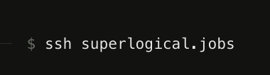

Mitchell Hashimoto (of Ghostty and HashiCorp fame) started a new company Superlogical, that's going to [build an ultimate multiplexer](https://www.superlogical.com//. ).  Given how much I love Ghostty, and love apps like CMUX that use the Ghostty embeddable library, I'm looking forward to seeing what another modern retake on TMUX looks like...

Plus, accessing their job board is pretty clever.  Totally makes sense for a company building a multiplexer.



What did I learn? Well, [Someone on hackerNews](https://news.ycombinator.com/item?id=49098965#49108106) recommended to stay anonymous, use:
```bash
ssh -o PubkeyAuthentication=no superlogical.jobs
```

and configured their `~/.ssh/config` to have at the end of it:
```bash
    Host *
    PubkeyAuthentication no
```

Pretty good tip to not accidentally leak my public identity via github when I don't intend to....